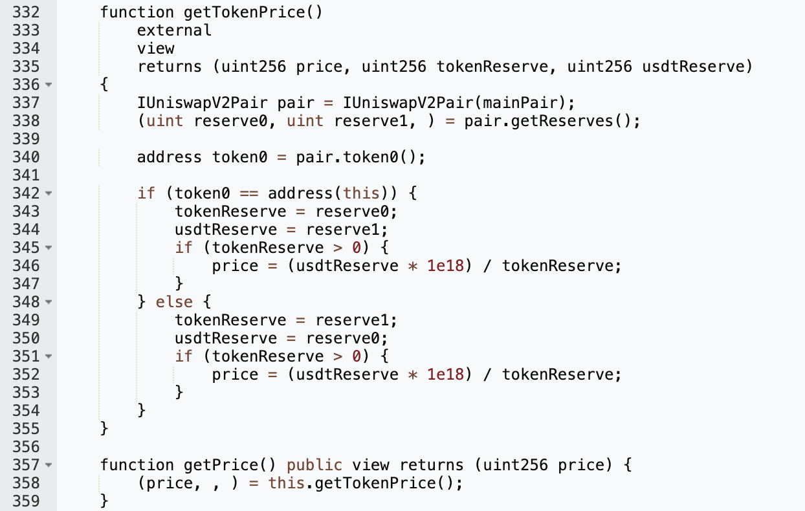
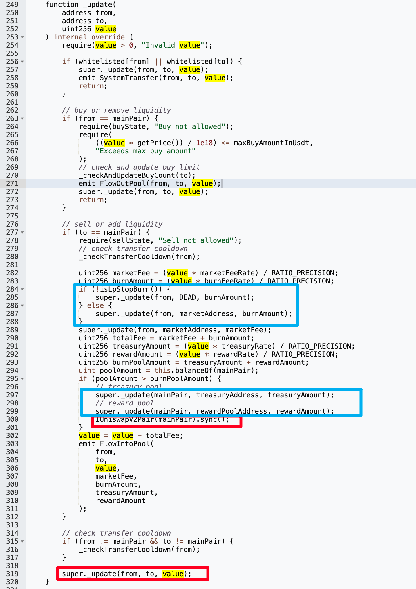
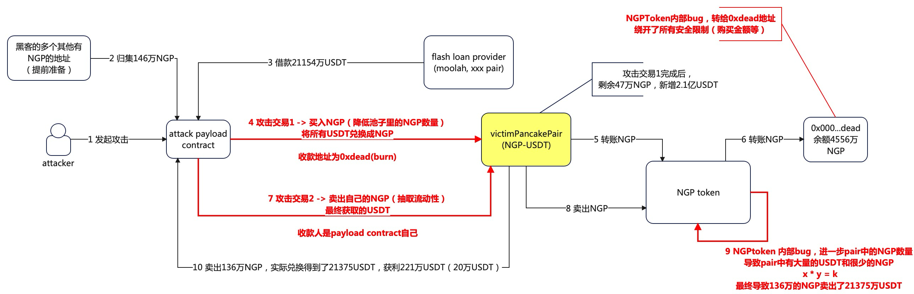

# NGP

## 1. Brief

Pancake-V2的一个池子给黑了，损失了200万刀，是一个fee/tax相关的土狗。

## 2. Info

- Attack hash: https://bscscan.com/tx/0xc2066e0dff1a8a042057387d7356ad7ced76ab90904baa1e0b5ecbc2434df8e1

## 3. Analysis

使用pair的reserve作为价格来源，这极易受到价格操纵。（当然这里不是特别利用了这个漏洞）

红色部分：在卖方代币转移出去之前，调用了`sync()`更新了pool的reserve。蓝色部分：DEAD地址是白名单，并且手续费从pair给到dev。这就造成了一个问题：pair的代币数量大于burnAmount这个阈值之后，将pair的token都给到dev使得币价暴涨，然后黑客作为卖方将代币转出。

黑客的操作：从多个不同的provider借来大量的USDT，然后从pair买token，将这些token发送给dead地址（白名单），因为是白名单，所以跳过了数量上的限制。这一步是为了减少pair中的token数量。然后黑客用自己提前准备好的大量的token来卖掉，在实际转出token之前触发`sync()`，使得pair中的token数量极少，币价极高。黑客得到了几乎所有的USDT，然后偿还闪电贷。

下图是整体的流程，来自TangCYxy的[文章](https://github.com/TangCYxy/Shares/tree/main/251009%20NGPToken%E6%94%BB%E5%87%BB%E5%88%86%E6%9E%900918)，这篇文章写的非常棒，这里就不额外多描述此攻击事件。另外他也在bilibili中上传了更加深入的[视频分析](https://www.bilibili.com/video/BV1Zq4BzREgS/?spm_id_from=333.1387.upload.video_card.click)

## 4. POC

https://github.com/SunWeb3Sec/DeFiHackLabs/blob/main/src/test/2025-09/NGP_exp.sol