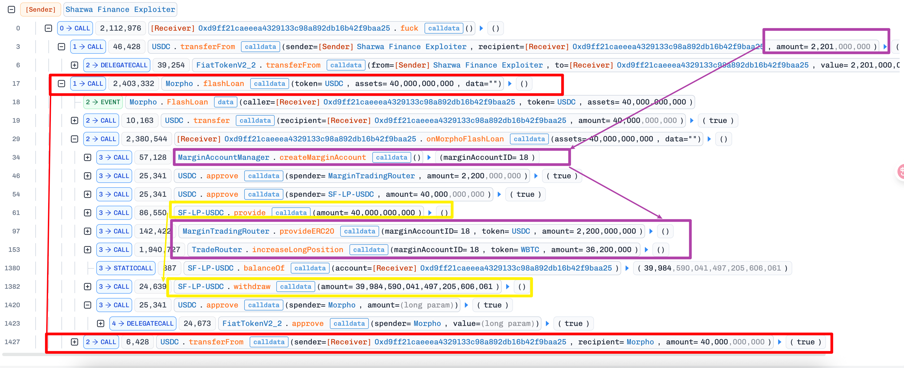
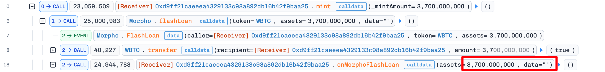
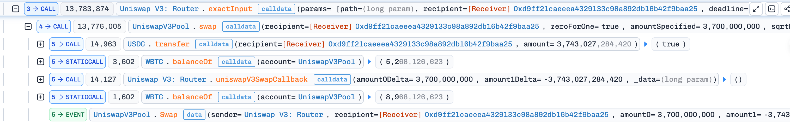
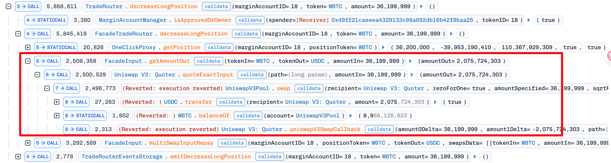
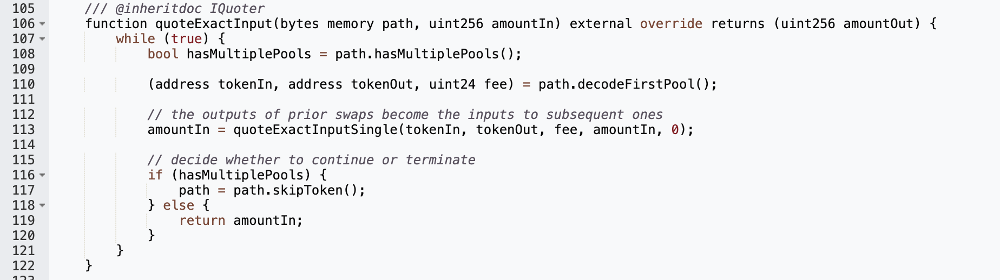
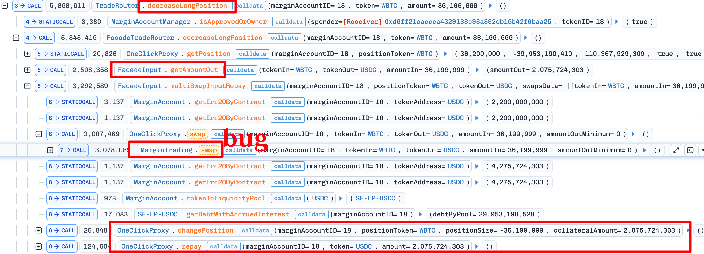
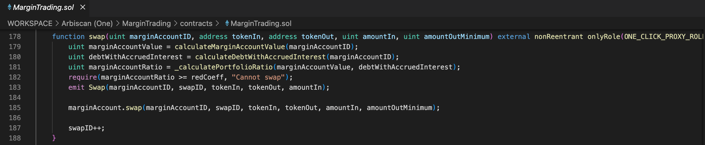
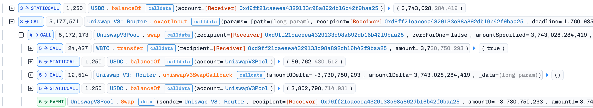

# SharwaFinance

## 1. Brief

使用现货价格作为价格来源、不正确的健康度检查导致的价格操纵攻击。

## 2. Info

- TX1 - 准备头寸：https://app.blocksec.com/explorer/tx/arbitrum/0xd64729c528e6689cb18b0c90345ab0c9ed18fea44247c89af2f1374643fc89c2
- TX2 - 价格操纵并攻击：https://app.blocksec.com/phalcon/explorer/tx/arbitrum/0x9f8b4841f805ec50cc6632068f759216d85633fbbe34afde86b97bbc41c23ead

## 3. Analysis

### 3.1 准备工作

- 紫色部分：用2201个USDC杠杆借出了0.362个WBTC
- 红色和黄色部分：
  - 问题：但是为什么要闪电贷40000个USDC然后在开仓之前provide流动性，然后在开仓之后withdraw流动性呢？
  - 回答：这是一个经典的手法，采用“临时注入-借贷-提取流动性”的方式。临时注入流动性到`SF-LP-UDSC`中，使得开仓的利率更低、借贷更容易成功，利用虚假的流动性获得（价格）获得比目前更好的超额杠杆，因为池子中的USDC更多了。同时也是做到了放大借贷头寸的作用。

### 3.2 开始攻击

1. 【闪电贷】：从Morpho闪电贷获得37个WBTC

   

2. 【价格操纵】：在UniswapV3池子中：将37个WBTC换成3,743,027个USDC，池子中的WBTC变多，USDC变少，WBTC的价格被操纵得变成低。

   

   下图可以看见，平仓的时候，会使用UniswapV3的quoter来计算可以换出多少的代币，也就是根据池子中的代币数量来确定价格了。但是此时，池子的价格已经在步骤2中被操纵了，WBTC的价格低。

   

   

3. 【平仓】由于WBTC的价格被瞬间操纵得变低了，因此现在黑客大约0.362个WBTC来平仓WBTC的杠杆借贷：得到2075个USDC

   

   注意，这个`MarginTrading.swap()`是有bug的：swap之前检查了头寸是健康的，但是swap之后没检查头寸健康情况。换句话说就是：黑客做到了操纵价格使得在swap的之前检查通过（健康度刚好满足一点点），swap之后却没有做健康检查（已经不健康了，坏账），为什么会从健康变得不健康呢？因为这个swap是在WBTC-USDC池子中进行的，同时健康度计算的价格来源用的是池子的现货价格。

   

   此时，完成了这个swap之后，坏账产生，协议遭到损失。下图是swap完成了：

   

4. 在UniswapV3池子中：将剩余的大量USDC换出了37个WBTC，WBTC价格回升到正常情况，黑客手中的0.362个WBTC变得非常值钱。

   

5. 最终还款37个WBTC的闪电贷，获利0.362个WBTC

最核心的2个问题：

- 使用了现货价格作为价格来源
- 降低仓位（swap）的时候，健康度检查有问题。降低仓位的操作、价格来源都来自同一个池子，降低仓位的时候严重影响了价格。

## 4. POC

https://github.com/SunWeb3Sec/DeFiHackLabs/blob/main/src/test/2025-10/SharwaFinance_exp.sol

## 5. Reference

- https://github.com/SunWeb3Sec/DeFiHackLabs/blob/main/src/test/2025-10/SharwaFinance_exp.sol
- https://x.com/Phalcon_xyz/status/1980219745480946087
- https://x.com/hklst4r/status/1980157251550670992
- https://x.com/0xfirmanregar/status/1994805323316826238
- Grok and Kimi